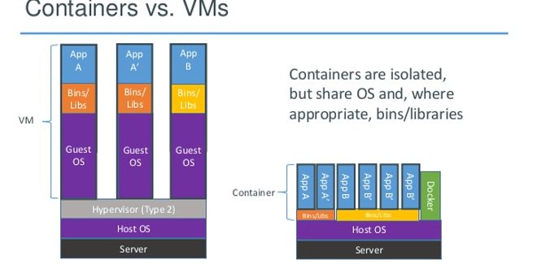

# Einführung Docker 

#### MUC, 08.01.2019

---
@snap[north]
## Wer bin ich?
@snapend

@snap[west]
@ul
- Lukas Grams
- Informatikstudent, 7. Semester
- Security-Fokus 
@ulend
@snapend

@snap[east]
@ul
- Container-Erfahrung als Werksstudent
- Mehrere Vorlesungen zum Thema
- Bei weitem **kein Spezialist**
@ulend
@snapend

+++

@snap[north]
## Disclaimer
@snapend

@ul
- Wissen vermitteln > Kompetenz zeigen
- Effizienz > Professionalität
@ulend

---

@snap[north]
## Agenda
@snapend

@ul
- Container - Was ist das, kann man das essen?
- Wofür brauch ich das?
- Docker & Friends
- Wie kann ich das benutzen?
- Praxisbeispiele!
- Wie kann ich weitermachen?
- Tipps
@ulend

Note:

Einführung, Vergleich zu VMs  
Einsatzmöglichkeiten  
Docker & Tools drumrum 
Bedienungsanleitung  
Beispiele  
Recherche-Links  
Best Practices

---

## Container
### Was ist das, kann man das essen?

+++

## Technische Grundlage
@ul
- Zwei Features des Linux-Kernels
- Process namespaces
- Control groups (cgroups)
@ulend

Note:

Linux Container allgemein, nicht nur Docker  
Weiß nicht viel, kurzer Abriss zu beidem

+++

## namespaces
@ul
- Beschränkt Sichtbarkeit auf...
- Prozesse
- Netzwerk
- Dateisystem
- Hostnamen
@ulend

Note:

Prozesse sehen Unterschiedliches
1 Rechner, 2 Prozesse, 2 Hostnamen

+++

## cgroups

@ul
- Beschränkt Zugriff auf...
- Ressourcen (RAM, CPU, ...)
- Geräte (Tastatur, WLAN, ...)
@ulend

Note:

Einschränkung binär oder graduell  
-> Prozess darf nicht auf GPU oder nur X shares

+++

@snap[west]
## Was bringt uns das?

@ul
- verschiedene Prozesse, vollkommen andere Umgebungen
- aber: gemeinsamer Kernel
- "VM-light"
@ulend

@snapend

@snap[east span-20]

@snapend

Note:

beliebig einstellen wer was sieht  
für docker: alle starten bei null, kochen eigenes süppchen  
optimierung: manche teilen sich noch sachen, nicht wichtig  
sieht ähnlich aus wie VM  

+++

Note:

Kein Hypervisor mehr  
Keine parallelen OS  
Docker-"Programm" verwaltet

+++

@snap[west]

### VMs
@ul
- etablierte Hypervisor
- "normales System"
- Ressourcen-"Verschwendung"
- Lange Anlaufzeiten
@ulend

@snapend

vs.

@snap[east]

### Container
@ul
- braucht Einarbeitung
- Ressourcensparend
- schneller oben
- wird komplex ab Cluster
@ulend

@snapend

Note:

VMs gibts lange, sehen für Admin aus wie normaler Rechner  
Anlaufzeiten beim Aufsetzen UND Hochfahren  
höhö  
Cluster = sahnehäubchen, kommt später

+++

## Verschiedene Container

@ul
- FreeBSD: Jails
- Solaris: Zones  
- Linux: **Docker**, Google Containers, LXC,  ...
- Docker = King
@ulend

Note:

Alternativen mit selber Idee, unterschiedlicher Umsetzung  
LXC mehr Prozesse, Docker einer pro Container  
Docker mit Abstand am verbreitetsten  
-> bester Support, mehr Tools drumrum

---

## Wofür brauch ich das?

+++

kein ersatz für VMs, sondern alternative

+++

use cases

---

## Docker & Friends

+++

@snap[west]
## Geschichtsstunde!

@ul
- Firma begonnen 2013 als dotCloud
- Rebranding zu Docker Inc.
- Open-Source Projekt mit "Freemium Modell"
- angefangen auf LXC-Basis
- jetzt direkt auf Kernel
@ulend

@snapend

@snap[east span-20]

@snapend

Note:

Enterprise Maintainer, OS -> cool  
Premium-Features wären Bonus für Production  
(Security, Private Repos, ...)

+++

Image, container, engine

+++

Docker Repo's, Docker Hub, private Repos

+++

Docker-Compose

+++

Orchestrierung, Kubernetes, Rancher, Swarm, DC/OS, Cloud-Integration

---

## Wie kann ich das benutzen?

+++

TODO

---

## Praxisbeispiele!

+++

TODO

---

## Wie kann ich weitermachen?

+++

TODO

---

## Tipps

+++

TODO

---

#Fragen?
